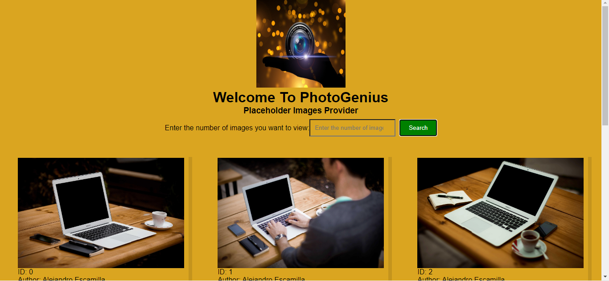
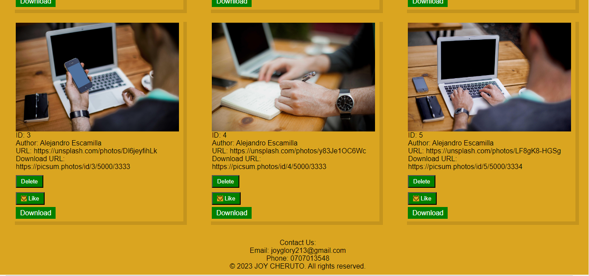

# PhotoGenius
This is a placeholder image provider website.

## Introduction
PhotoGenius is a website that allows you to search for the number of photos you need as placeholder images for your web development projects. The data is fetched from an API and displayed on the website.

## Installation Requirements
To use PhotoGenius, you will need the following:
1. A laptop with an installed operating system.
2. An internet connection.
3. A code editor, such as VS Code.
4. A Node.js environment.
5. A web browser.

## Installation Steps
1. Clone the project onto your computer.
2. Open your terminal/command prompt.
3. Navigate to the project's root folder.
4. Run the following command: `git clone <repository_url>`.
5. Copy the path to the `index.html` file and paste it in your web browser to view the webpage.
6. Alternatively, you can visit the live version of the website hosted on GitHub Pages using the following link: [PhotoGenius on GitHub Pages](https://cheruto23.github.io/PhotoGenius/).
7. The content is displayed according to your internet speed after searching for the number of images you need.

## Technology Used
PhotoGenius is built using the following technologies:
1. HTML - for structuring the website.
2. CSS - for styling the website.
3. JavaScript - for adding interactivity to the website.

## Author
- Joy Cheruto

## License and Copyright
MIT License Copyright (c) 2023 Joy Cheruto

# Website screenshots

